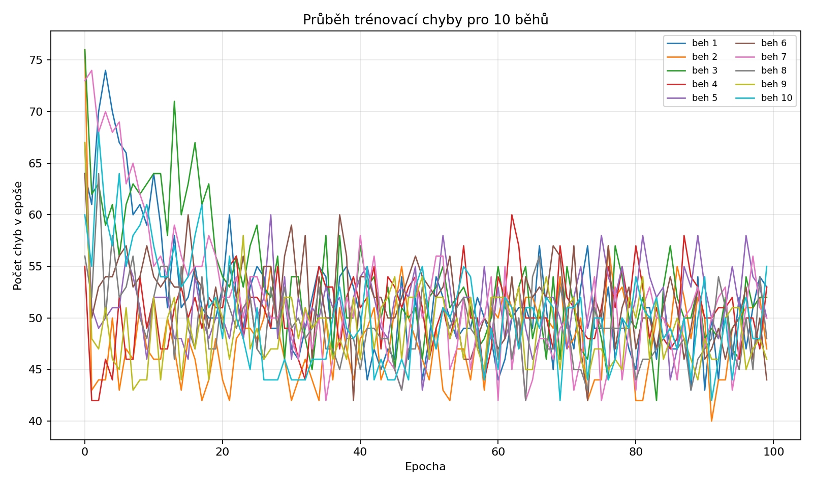
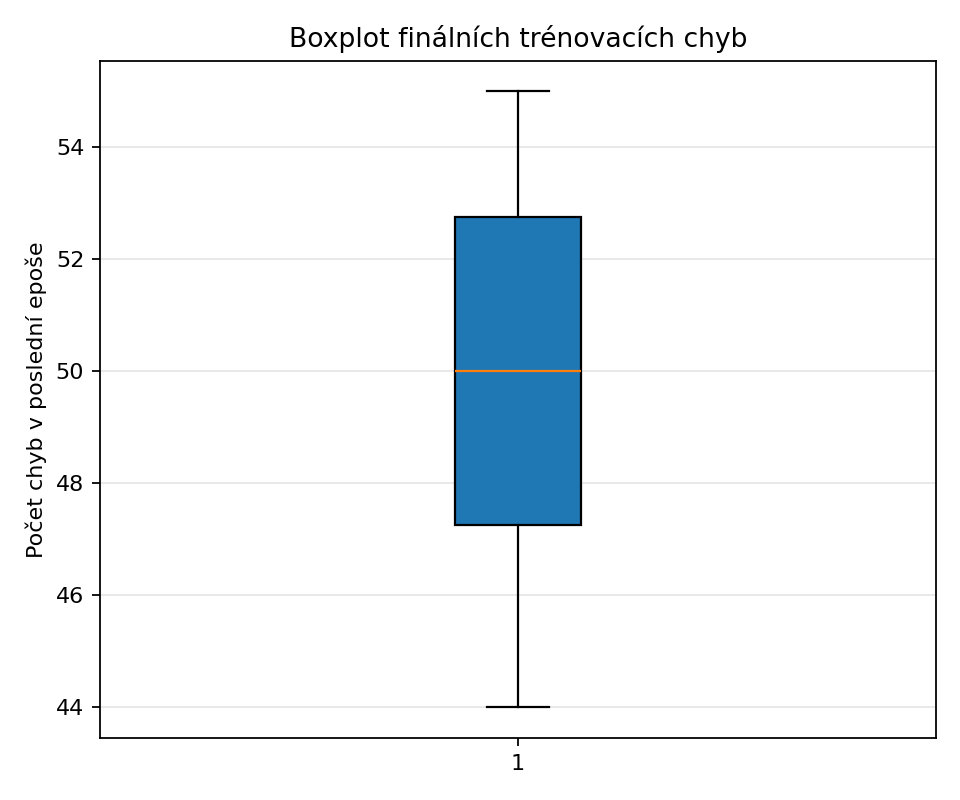
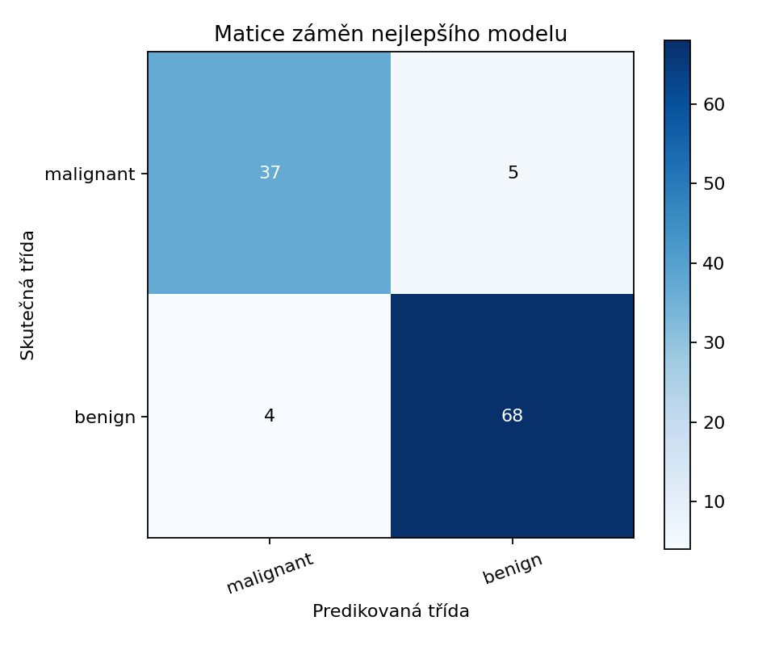

# Deník – experiment s jednoduchým perceptronem

## Název experimentu
Jednoduchý perceptron pro binární klasifikaci datasetu Breast Cancer Wisconsin.

## Cíl úlohy
Implementovat jednoduchý perceptron, ověřit jeho funkčnost a porovnat 10 trénování se stejnými hyperparametry a různou inicializací vah.

## Popis zadání
Zadání požadovalo veřejný dataset upravený pro perceptron, uložení průběhu trénovací chyby a finálních vah pro 10 běhů, výběr nejlepšího modelu a jeho vyhodnocení na testovacích datech pomocí matice záměn.

## Použitá data / úprava datasetu
Byl použit vestavěný dataset `sklearn.datasets.load_breast_cancer`.
Pro perceptron byly vybrány 4 příznaky: `['mean radius', 'mean texture', 'mean perimeter', 'mean area']`.
Data byla rozdělena stratifikovaně na trénovací a testovací část v poměru 80:20 a standardizována podle statistik trénovací množiny.

## Postup řešení
- Počet běhů: `10`
- Počet epoch: `100`
- Learning rate: `0.01`
- V každém běhu byly uloženy průběhy chyb a finální váhy.
- Nejlepší model byl zvolen podle nejnižší finální trénovací chyby; při shodě rozhodla vyšší testovací přesnost.

## Implementace / zvolená metoda
Perceptron používá binární aktivační funkci, predikci `sign(w·x + b)` a klasické perceptronové chybové učení.
Implementovány jsou metody `activation`, `predict`, `train`, `test`, `save` a `load`.

## Výsledky
- Nejlepší běh: `6` se seedem `106`
- Finální trénovací chyba nejlepšího běhu: `44`
- Test accuracy: `0.9211`
- Precision: `0.9315`
- Recall: `0.9444`
- F1-score: `0.9379`
- Rozptyl finálních chyb v 10 bězích: min `44`, medián `50.0`, max `55`

## Vizualizace výsledků
### Průběh trénovací chyby pro všech 10 běhů

### Boxplot finálních trénovacích chyb

### Matice záměn nejlepšího modelu

## Diskuze výsledků
Deset běhů se stejnými hyperparametry skončilo s finální trénovací chybou v intervalu `44–55`, průměr byl `49.8` a směrodatná odchylka `3.34`. Boxplot proto ukazuje, že model není extrémně nestabilní, ale počáteční váhy mají měřitelný vliv na to, do jakého lineárního rozhraní perceptron konverguje.
Testovací accuracy kolísala mezi `0.8772` a `0.9386`, tedy zhruba o šest procentních bodů. Nejlepší běh podle zvoleného kritéria nejnižší trénovací chyby nebyl zároveň absolutně nejlepší podle test accuracy, což je rozumné upozornění, že výběr modelu jen podle trénovacích chyb nemusí optimálně odrážet generalizaci.
Matice záměn `[[37, 5], [4, 68]]` znamená celkem `9` chyb z `114` testovacích vzorků. Síť mírně častěji zaměňovala maligní vzorky za benigní (`5` případů) než opačně (`4` případy), takže recall pro třídu `malignant` (`0.8810`) je nižší než pro `benign` (`0.9444`). To naznačuje, že vybrané čtyři příznaky dělají úlohu pro lineární perceptron dobře řešitelnou, ale ne dokonale lineárně separovatelnou.
Vzhledem k tomu, že jde o velmi jednoduchý lineární model bez skrytých vrstev, je accuracy `0.9211` solidní výsledek. Zároveň je zřejmé, že složitější nelineární model by mohl část zbývajících chyb odstranit, zejména v hraničních případech mezi oběma třídami.

## Závěr
Experiment splnil zadání a ukázal, že jednoduchý perceptron na vybraných znacích datasetu Breast Cancer Wisconsin poskytuje použitelnou, ale ne bezchybnou lineární hranici. Výsledky jsou mezi běhy poměrně konzistentní, přesto výběr modelu podle samotné trénovací chyby není plně ekvivalentní výběru podle generalizační výkonnosti.
Hlavním omezením je samotná kapacita perceptronu: model neumí zachytit nelineární vztahy mezi příznaky a reportovaný výsledek je proto spíše baseline. Přirozeným rozšířením by bylo porovnat perceptron s logistickou regresí nebo malou vícevrstvou sítí nad stejným výběrem příznaků.
