# NNUI2 – Cvičení 3: Diskrétní Hopfieldova síť

## Název experimentu
Diskrétní Hopfieldova síť jako asociativní paměť pro toy vzory 3×3 a binarizované vzory z MNIST.

## Cíl úlohy
Implementovat diskrétní Hopfieldovu síť s Hebbovým učením, energií a synchronním vybavováním,
ověřit chování na malých vzorech 3×3 a následně otestovat recall na čtyřech třídách MNIST.

## Popis zadání
Zadání vyžadovalo konstruktor s `input_size` a `bipolar`, váhovou matici `W`, metody `preprocess`, `train`, `energy`, `recall`, ukládání historie stavů a energií, detekci stability nebo oscilace a dokumentaci průběhu recallu v deníku.

## Použitá data / úprava datasetu
- Toy část používá dva ručně definované binární vzory 3×3.
- MNIST část používá čtyři uložené a čtyři dotazové vzory z datasetu `local npz (/Users/dasky/.keras/datasets/mnist.npz)`.
- Obrázky byly binarizovány a zmenšeny z `28x28` na `14x14` blokovým průměrem.

## Postup řešení
- Implementován byl synchronní recall s logováním všech mezistavů a hodnot energie.
- Funkčnost vah a recallu byla ověřena přesným příkladem ze slajdů a následně toy experimentem 3×3.
- Pro MNIST byly vybrány čtyři různé třídy, pro každou jeden uložený a jeden dotazový vzor.

## Implementace / zvolená metoda
- `HopfieldNet` používá ne-normalizované Hebbovo učení `W = Σ p p^T` a nulovou diagonálu vah.
- Recall je synchronní a loguje stavy i energii `E = -0.5 * s^T W s`.
- Implementována je detekce fixpointu i 2-cyklu.

## Validace podle slajdu (Příklad 1)
- Ověřeno testem `tests/test_example1_slide_data.py`.
- Trénovací vzory: `x1 = [1, 1, 1, -1]`, `x2 = [1, 1, -1, -1]`.
- Očekávaná Hebbova matice (bez normalizace):

```text
[[ 0,  2,  0, -2],
 [ 2,  0,  0, -2],
 [ 0,  0,  0,  0],
 [-2, -2,  0,  0]]
```

- Recall ze `s0 = [-1, 1, -1, -1]` má trajektorii `s1 = [1, 1, 1, 1]`, `s2 = [1, 1, 1, -1]` (fixpoint = `x1`).

## Výsledky
### Validace podle slajdu (Příklad 1)
- Váhová matice i trajektorie recallu odpovídají očekávanému řešení ze slajdu.

### 3×3 test
- Seed: `123`, flipnuté pozice: `[1, 2]`, reason: `fixed_point`, iterace: `2`
- Nejbližší uložený vzor (Hamming): `0`

## Vizualizace výsledků
### Toy vzory 3×3
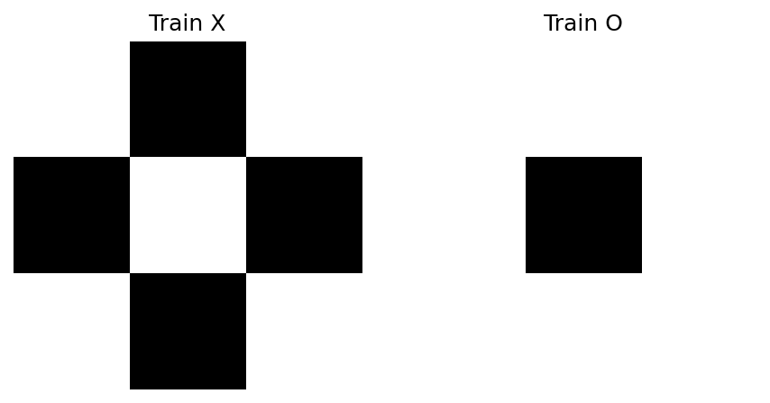

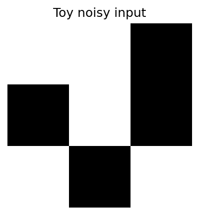

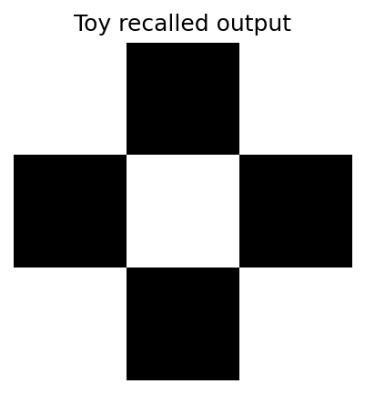

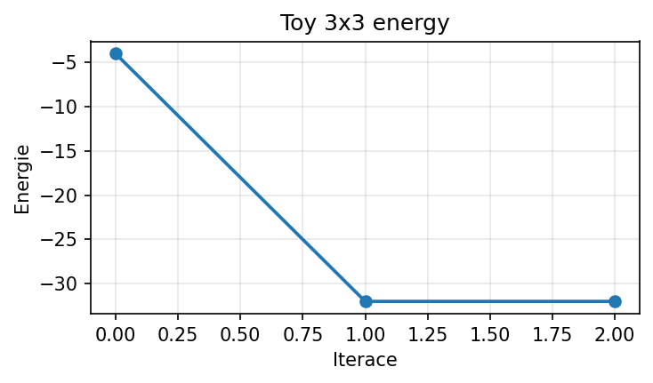

### MNIST experiment
- Zdroj datasetu: `local npz (/Users/dasky/.keras/datasets/mnist.npz)`
- Třídy: `[0, 1, 4, 7]`
- Downsample: `14x14`

| třída | converged | iters | reason | match | best_hamming |
| --- | --- | --- | --- | --- | --- |
| 0 | ano | 3 | fixed_point | ne | 12 |
| 1 | ano | 2 | fixed_point | ne | 5 |
| 4 | ano | 2 | fixed_point | ne | 11 |
| 7 | ano | 2 | fixed_point | ne | 11 |

### Dotaz 1 (třída 0)
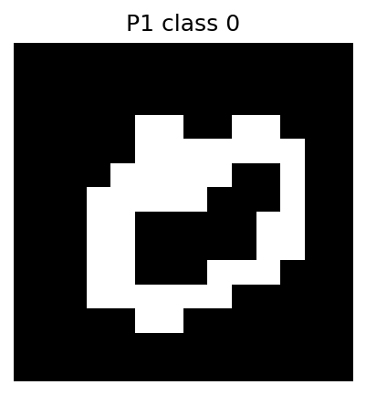

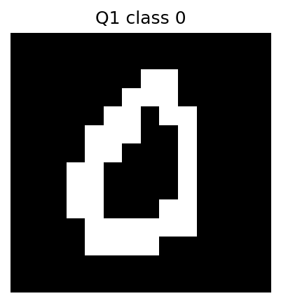

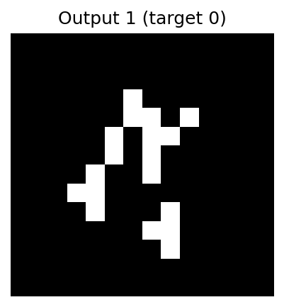

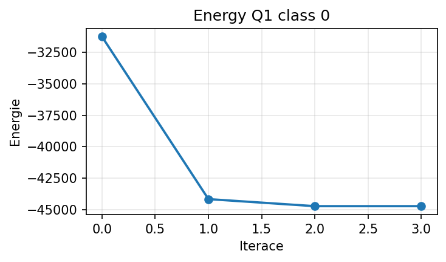

### Dotaz 2 (třída 1)
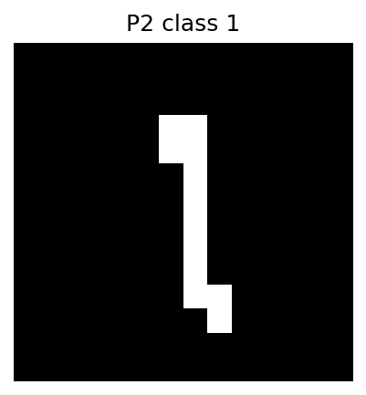

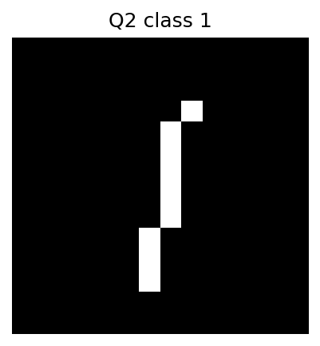

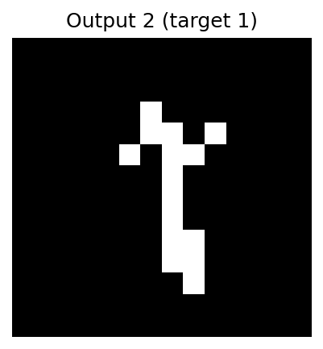

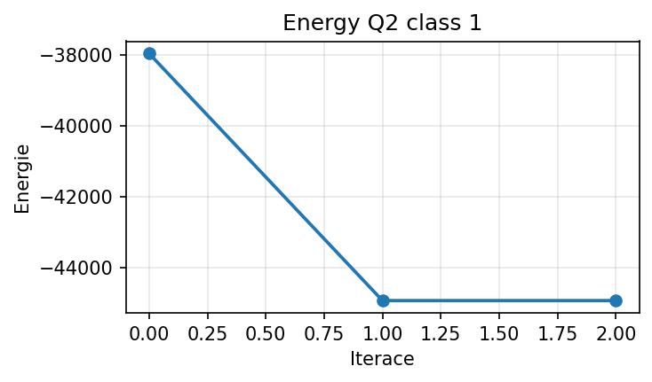

### Dotaz 3 (třída 4)
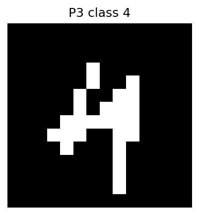

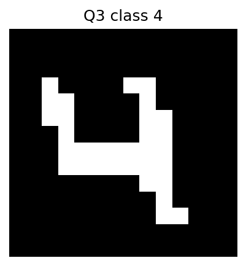


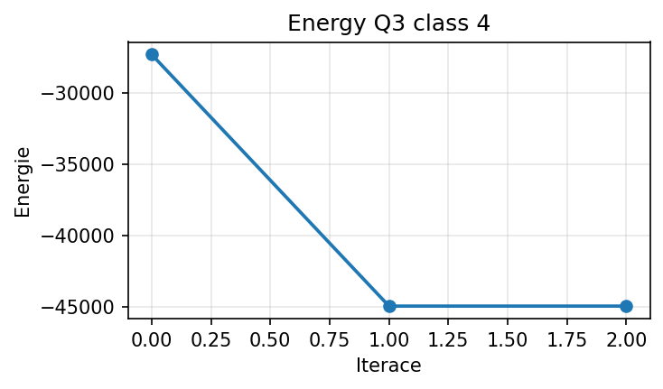

### Dotaz 4 (třída 7)
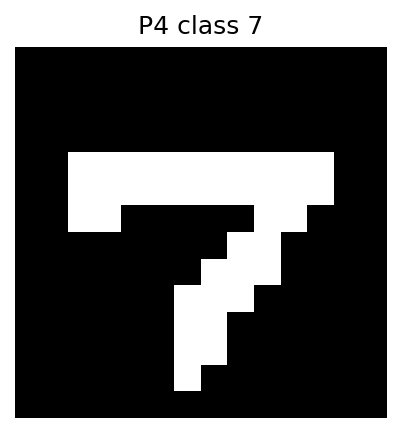

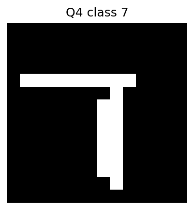

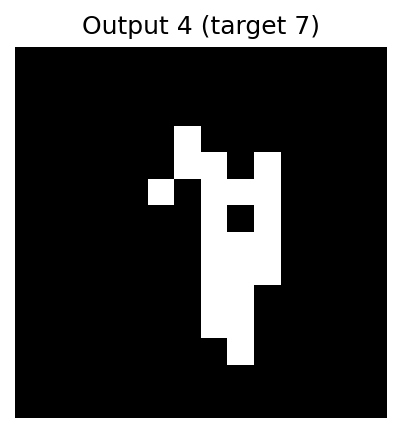

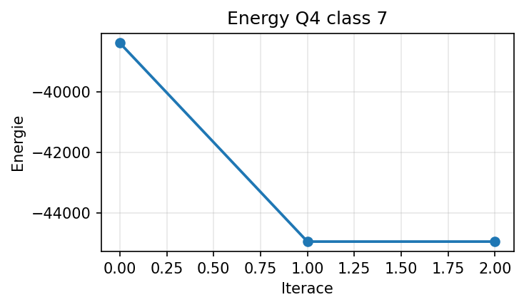

## Diskuze výsledků
Toy experiment 3×3 skončil přesně podle očekávání asociativní paměti: energie klesla z `-4` na `-32` a další iterace už stav nezměnila, takže recall skončil ve fixpointu bez známky oscilace. To potvrzuje, že implementace Hebbova učení, nulové diagonály i synchronního recallu je funkční.
U MNIST všechny čtyři dotazy konvergovaly během `2–3` iterací do fixpointu, ale ani jeden recall neskončil přesně v některém z uložených vzorů. Nejlepší Hammingova vzdálenost k uloženému vzoru byla `5`, nejhorší `12`, takže samotná konvergence zde neznamená úspěšné vybavení původního obrazu. Síť se stabilizovala v jiném atraktoru, který je uloženému vzoru pouze podobný.
Rozdíl mezi toy a MNIST částí dobře ilustruje kapacitní omezení Hopfieldovy sítě. U malých, silně strukturovaných 3×3 vzorů je energetická krajina jednoduchá a recall spolehlivý, zatímco u zmenšených binárních obrazů `14x14` roste interferenční šum mezi uloženými vzory a významně záleží na kvalitě binarizace i míře podobnosti číslic. Proto je tato síť vhodnější jako demonstrační asociativní paměť než jako robustní rozpoznávač komplikovanějších obrazových dat.
Validitu závěrů omezuje to, že byl použit jen jeden uložený vzor na třídu a pouze čtyři dotazy. Rozumným pokračováním by bylo systematicky měnit počet uložených vzorů, míru zašumění dotazu nebo rozměr downsamplingu a sledovat, kdy začíná prudce růst počet chybných atraktorů.

## Závěr
Implementace Hopfieldovy sítě splňuje požadované metody i vlastnosti vah a byla ověřena jak jednotkovými testy, tak experimentálně. Na malých vzorech síť funguje přesně jako očekávaná asociativní paměť, ale na MNIST se ukazuje klasické omezení Hopfieldova modelu: rychlá konvergence ještě nezaručuje korektní recall původního vzoru.
Výsledky jsou proto vědecky konzistentní s teorií kapacity Hopfieldových sítí. Síť je vhodná pro demonstraci energetické optimalizace a fixpointů, nikoli pro přesnou klasifikaci složitějších obrazových dat bez dalšího zpracování nebo modernější architektury.
