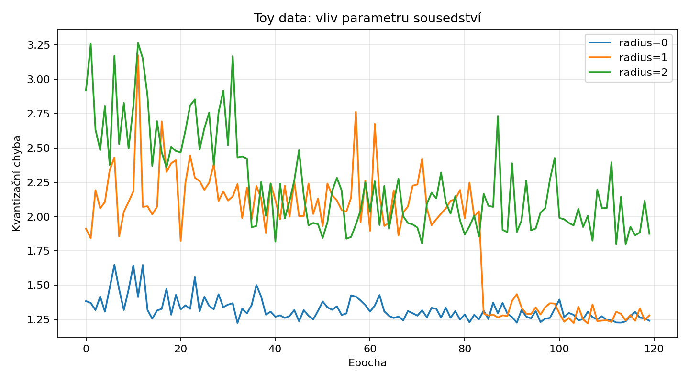
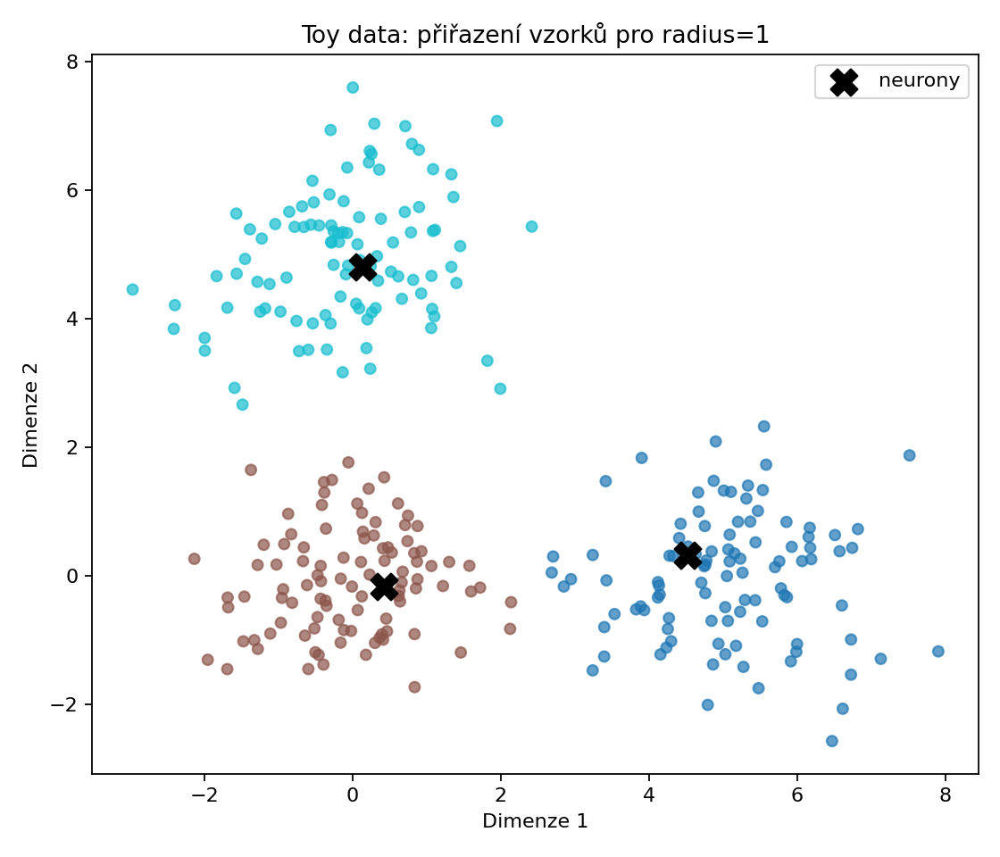
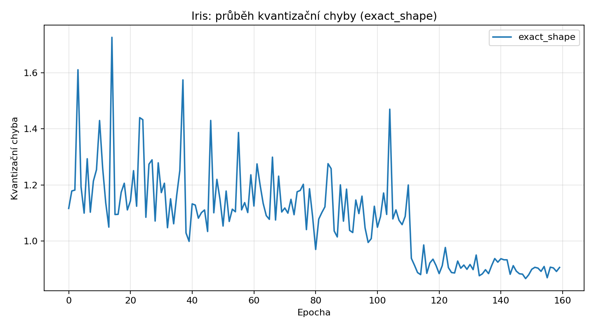
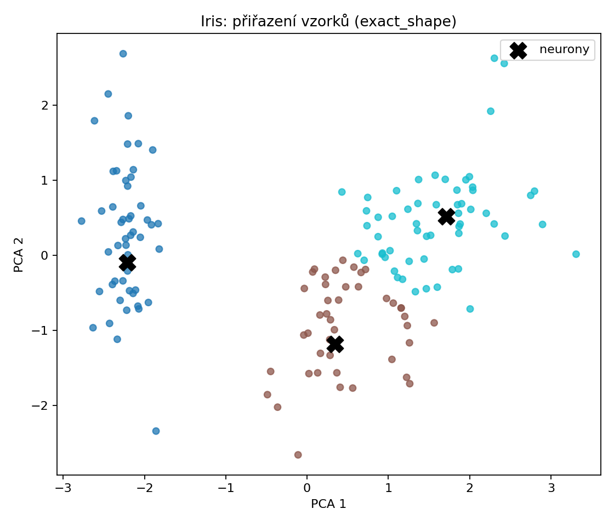
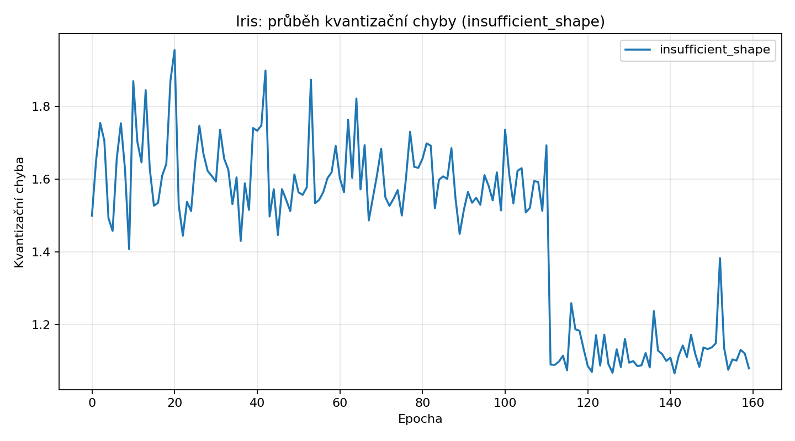
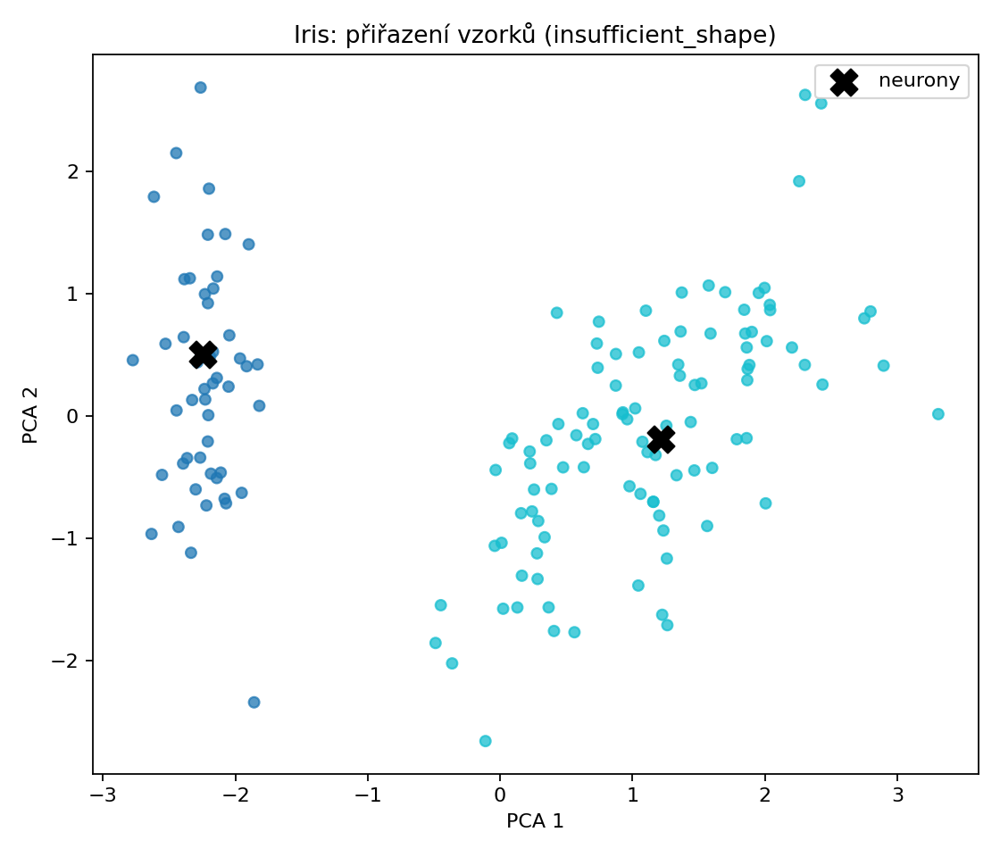
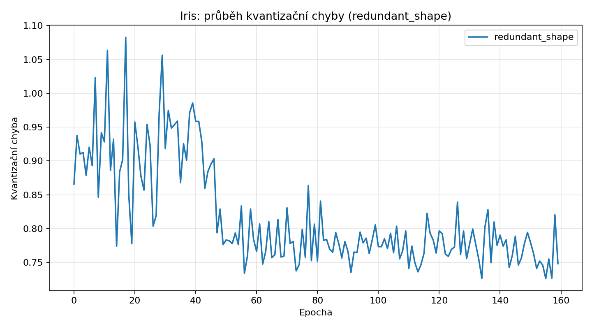
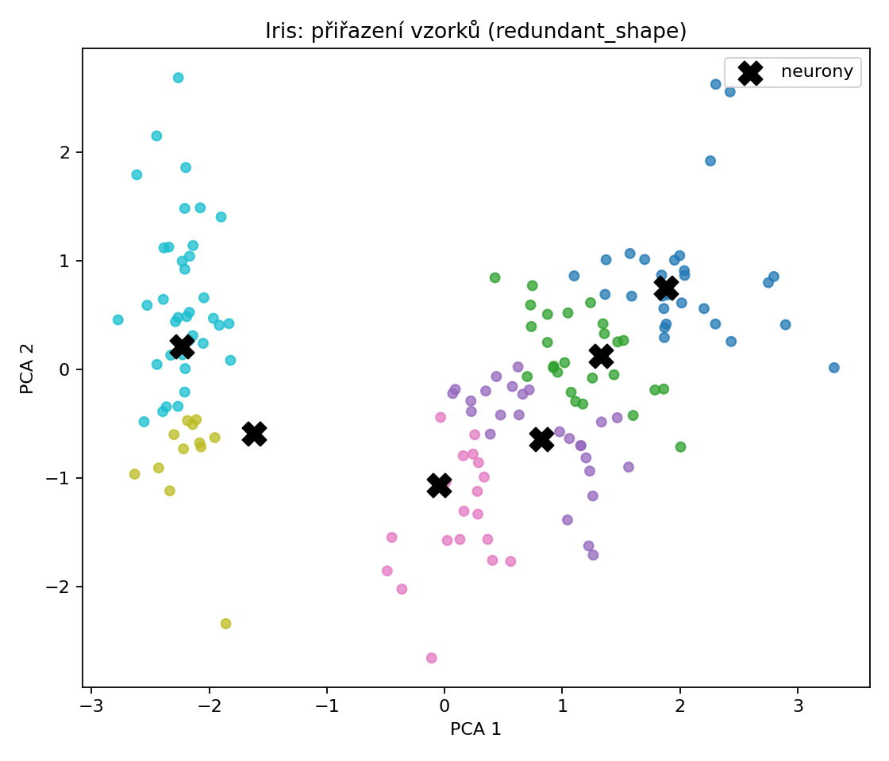

# NNUI2 – Cvičení 4: Kohonenova samoorganizační mapa

## Název experimentu
Kohonenova samoorganizační mapa pro shlukování syntetických dat a datasetu Iris.

## Cíl úlohy
Implementovat 1D samoorganizační mapu, ověřit pokles kvantizační chyby a porovnat chování mapy pro různé počty neuronů a různé sousedství.

## Popis zadání
Zadání vyžadovalo objekt SOM s metodami `bmu`, `neighborhood`, `quantization_error`, `predict` a `train`, test na syntetických 2D shlucích a experimenty na veřejném datasetu Iris pro tři konfigurace mapy.

## Použitá data / úprava datasetu
Toy experiment používá tři gaussovské shluky kolem bodů `(0,0)`, `(5,0)` a `(0,5)`.
Veřejná data tvoří `sklearn.datasets.load_iris`; vstupy byly standardizovány na nulový průměr a jednotkovou odchylku.

## Postup řešení
- Toy experiment: `n_units=3`, `epochs=120`, `lr=0.5`, porovnání `radius ∈ {0,1,2}`.
- Iris experiment: přesný tvar `3` neurony, nedostatečný tvar `2` neurony, redundantní tvar `6` neuronů.
- V každé epoše se ukládá kvantizační chyba a po natrénování se vyhodnocuje čistota přiřazení vůči třídám Iris.

## Implementace / zvolená metoda
Vítězný neuron je vybírán jako BMU podle eukleidovské vzdálenosti. Váhy vítěze i jeho okolí se aktualizují s exponenciálně klesajícím learning rate.
Sousedství je realizováno v 1D kompetiční vrstvě a průběh kvantizační chyby je ukládán do atributu `history`.

## Výsledky
- Toy radius=0: finální kvantizační chyba `1.2420`
- Toy radius=1: finální kvantizační chyba `1.2795`
- Toy radius=2: finální kvantizační chyba `1.8741`
- Iris exact_shape: kvantizační chyba `0.9058`, purity `0.8467`
- Iris insufficient_shape: kvantizační chyba `1.0798`, purity `0.6667`
- Iris redundant_shape: kvantizační chyba `0.7481`, purity `0.8400`

## Vizualizace výsledků
### Toy data – porovnání sousedství

### Toy data – přiřazení vzorků pro radius=1

### Iris – přesný tvar

### Iris – nedostatečný tvar

### Iris – redundantní tvar

## Diskuze výsledků
Na toy datech vyšla nejnižší finální kvantizační chyba pro `radius=0` (`1.2420`), zatímco `radius=1` byl jen mírně horší (`1.2795`) a `radius=2` výrazně horší (`1.8741`). To ukazuje, že v tomto konkrétním jednoduchém problému příliš široké sousedství zbytečně brzdí specializaci prototypů; vítězný neuron a jeho sousedé se posouvají podobným směrem a mapa se učí příliš hladce.
Na Iris je dobře vidět rozdíl mezi kvantizační chybou a separací tříd. Redundantní tvar má sice nejnižší kvantizační chybu (`0.7481`), ale purity `0.8400` je mírně horší než u přesného tvaru `exact_shape` s purity `0.8467`. Nižší kvantizační chyba tedy znamená, že prototypy lépe aproximují rozložení vstupů, ale ne nutně to, že lépe respektují třídní strukturu datasetu.
Nedostatečný tvar se dvěma neurony je nejslabší ve všech směrech: kvantizační chyba `1.0798` je nejvyšší a purity `0.6667` potvrzuje, že dva prototypy nestačí pokrýt tři přirozené skupiny v datech. Přesný tvar se třemi neurony tak představuje nejlepší kompromis mezi reprezentací dat a interpretovatelným rozdělením tříd, zatímco redundantní tvar je vhodnější pro jemnější aproximaci prostoru než pro čisté mapování tříd.
Validitu závěru omezuje to, že šlo o jeden seed a jednoduchou 1D kompetiční vrstvu. Dalším krokem by bylo opakovat běhy s více inicializacemi a porovnat i 2D SOM mřížku, kde se mohou projevit topologické vztahy mezi třídami výrazněji.

## Závěr
Implementace SOM odpovídá zadání a výsledky potvrzují očekávané chování modelu. Šířka sousedství významně ovlivňuje rychlost a charakter specializace neuronů a na veřejném datasetu Iris se ukazuje, že nejlepší separace tříd nemusí nastat tam, kde je nejnižší kvantizační chyba.
Pro odevzdání je důležité, že report neukazuje jen průběh chyb, ale i jejich interpretaci: exact shape nejlépe odpovídá třídní struktuře úlohy, insufficient shape je kapacitně slabý a redundant shape zlepšuje aproximaci vstupního prostoru za cenu méně jednoznačného mapování tříd.
