# NNUI2 – Cvičení 5: Vícevrstvá dopředná neuronová síť

## Název experimentu
FFNN pro regresní aproximaci syntetické funkce a datasetu z LMS.

## Cíl úlohy
Implementovat objekt FFNN s jednou skrytou vrstvou, ověřit backpropagaci na syntetické úloze a porovnat více konfigurací nad připraveným regresním datasetem.

## Popis zadání
Zadání požadovalo implementaci metod `normalize`, `activation`, `activation_derivative`, `forward`, `train_epoch`, `validate`, `test` a `train`, syntetický test s `input_dim=3` a hlavní experiment nad daty z LMS s ukládáním train/validation křivek a testovacích chyb.

## Použitá data / úprava datasetu
Syntetický test používá 100 vzorků z intervalu `[-1, 1]` a dva zašuměné cíle podle vzorců ze zadání.
Hlavní experiment používá soubory `cviceni/Cv5_Data/train.csv`, `val.csv` a `test.csv`. Vstupy i cíle byly normalizovány metodou min-max podle trénovací množiny a metriky jsou reportovány po převodu zpět do původní škály.

## Postup řešení
- Syntetická kontrola: `hidden_units=10`, `epochs=150`, `lr=0.05`, `tanh` ve skryté vrstvě.
- Hlavní experiment: 8 konfigurací pokrývajících malé sítě, vysoké learning rate a rozsahy `10–30` neuronů pro krátké i dlouhé učení.
- Pro každou konfiguraci byl uložen společný graf train/validation chyby a testovací MSE/MAE.

## Implementace / zvolená metoda
Síť používá jednu skrytou vrstvu, bias je integrován do vah `V` a `W`, trénování probíhá online backpropagací nad MSE ztrátou.
Pro kratší běhy byla použita `tanh`, pro dlouhé běhy `relu`, výstupní vrstva je lineární.

## Výsledky
- Syntetická kontrola: finální train MSE `0.0140`, validation MSE `0.0244`
- Nejlepší konfigurace: `range1000_h30`
- Nejlepší test MSE: `0.0372`
- Nejlepší test MAE: `0.1508`

| konfigurace | hidden | epochs | lr | aktivace | test MSE | test MAE |
| --- | --- | --- | --- | --- | --- | --- |
| few_lr0.01_h3 | 3 | 100 | 0.01 | tanh | 0.5937 | 0.6112 |
| few_lr0.55_h3 | 3 | 100 | 0.55 | tanh | 2.0476 | 1.2500 |
| range50_h10 | 10 | 50 | 0.05 | tanh | 0.7238 | 0.6779 |
| range50_h20 | 20 | 50 | 0.05 | tanh | 0.6966 | 0.6978 |
| range50_h30 | 30 | 50 | 0.05 | tanh | 0.8322 | 0.7374 |
| range1000_h10 | 10 | 1000 | 0.02 | relu | 0.3557 | 0.5013 |
| range1000_h20 | 20 | 1000 | 0.02 | relu | 0.1019 | 0.2403 |
| range1000_h30 | 30 | 1000 | 0.02 | relu | 0.0372 | 0.1508 |

## Vizualizace výsledků
### Syntetická kontrola objektu FFNN
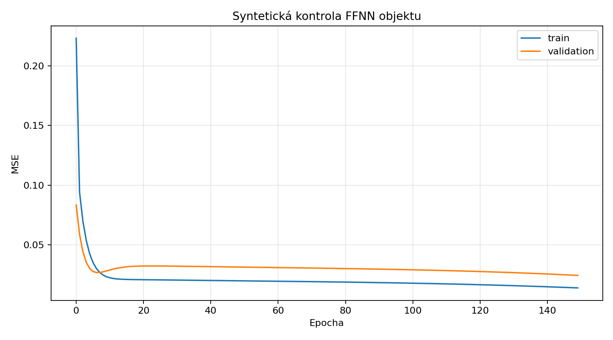

### Souhrn testovacích MSE
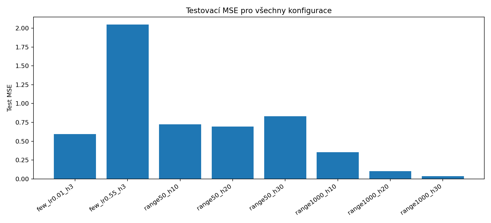

### Nejlepší model – predikce vs. skutečnost
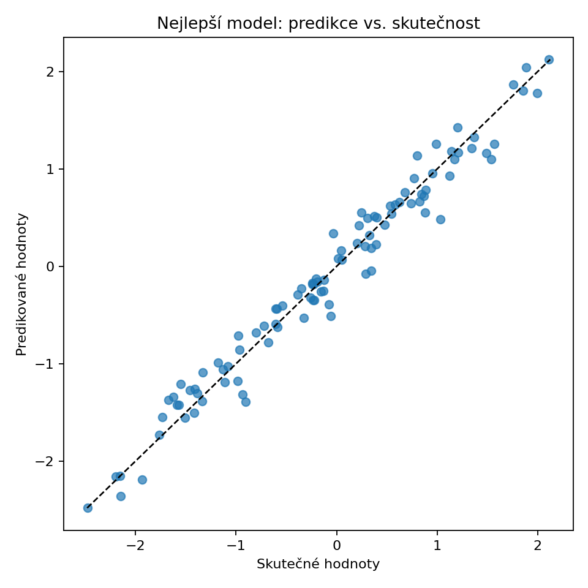

### Křivky jednotlivých konfigurací
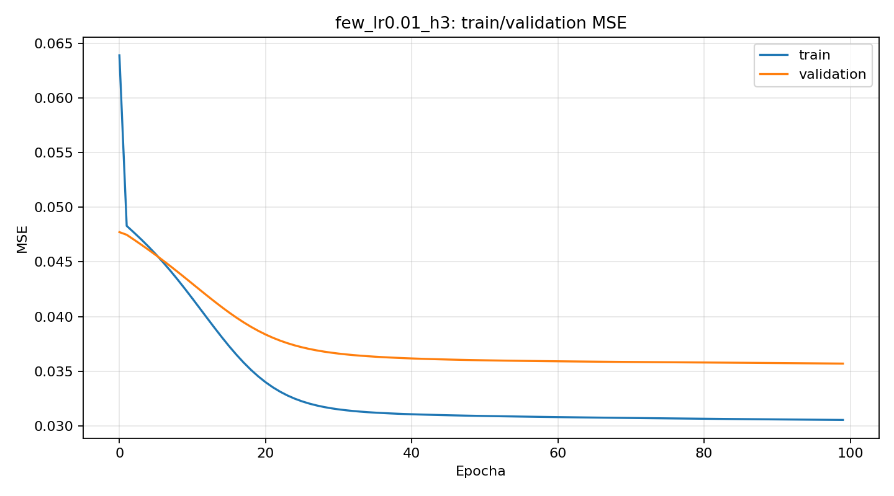
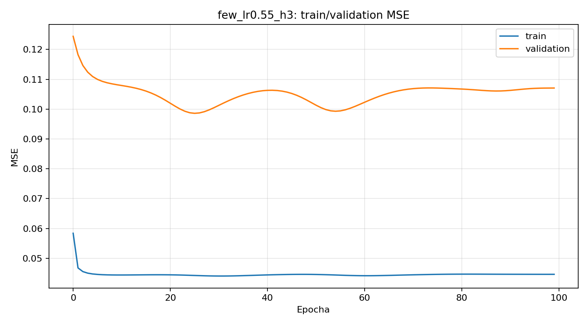
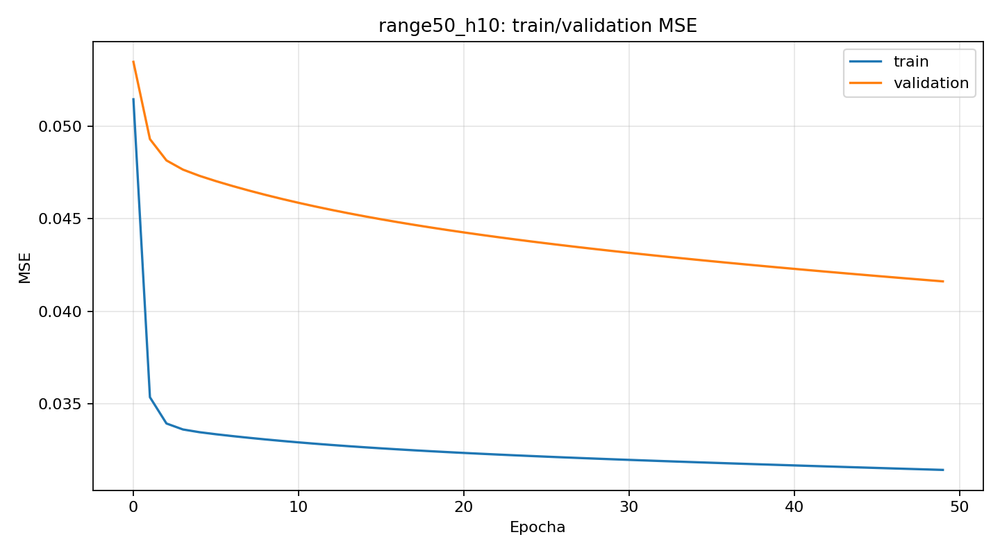
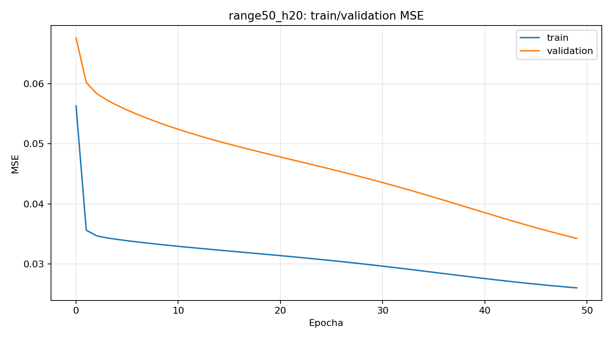
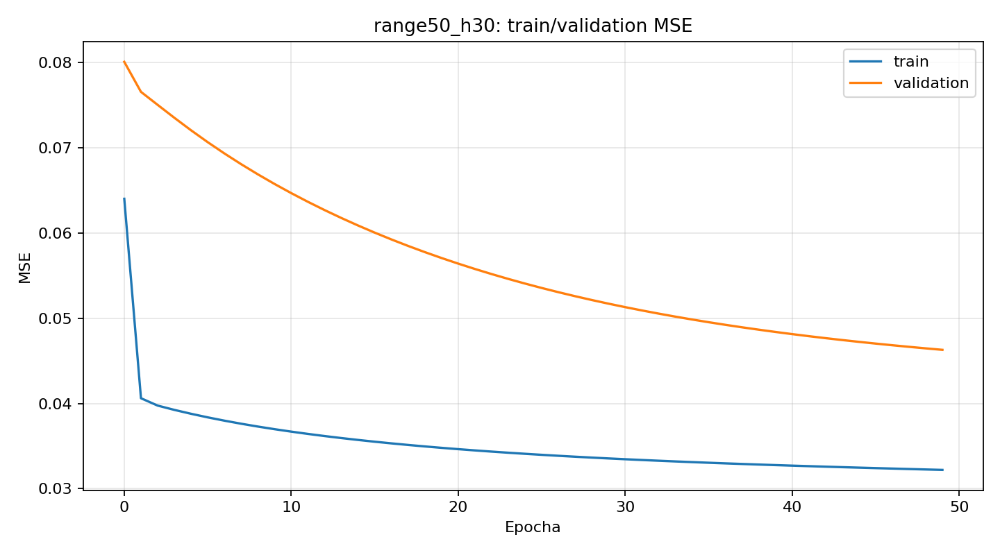
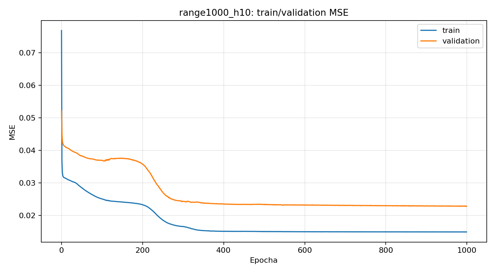
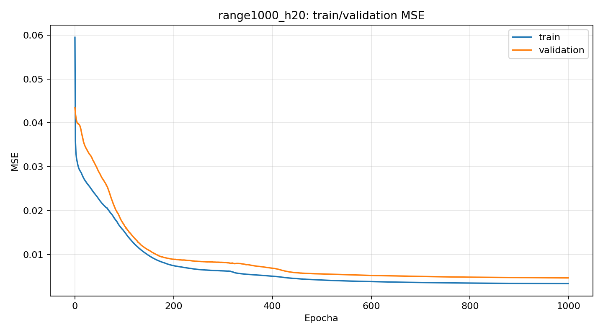
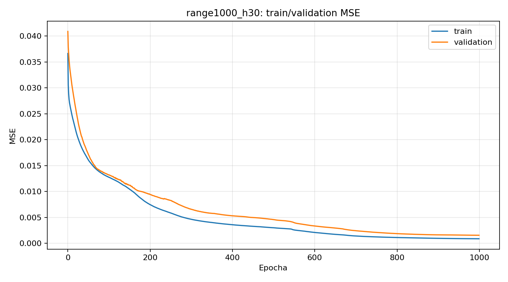

## Diskuze výsledků
Syntetická úloha potvrdila funkčnost implementace: train MSE klesla na `0.0140` a validation MSE na `0.0244`, takže FFNN zvládl aproximovat zadané nelineární vztahy bez zjevné divergence. To je důležité jako kontrola, že backpropagace i derivace aktivačních funkcí jsou implementovány korektně.
Na hlavním datasetu je dobře patrný underfitting u krátkých nebo příliš malých konfigurací. Varianty `few_lr0.01_h3`, `range50_h10`, `range50_h20` a `range50_h30` končí s relativně vysokými test MSE `0.59–0.83`, což ukazuje, že omezená kapacita nebo krátké učení nestačí k přesné aproximaci funkce.
Konfigurace `few_lr0.55_h3` je naopak příkladem nestabilního učení: validační chyba `0.1071` je výrazně vyšší než trénovací `0.0446` a současně má zdaleka nejhorší test MSE `2.0476`. Vysoký learning rate zde neurychlil konvergenci k lepšímu řešení, ale zhoršil generalizaci.
Nejlepší konfigurace `range1000_h30` kombinuje dostatečnou kapacitu a dlouhé učení. Má nejnižší train MSE `0.0009`, validation MSE `0.0015` i test MSE `0.0372`, přičemž rozdíl mezi train a validation chybou je velmi malý (`0.0007`). To nenaznačuje silné přeučení; model se naopak naučil stabilní aproximaci, která se dobře přenáší i na testovací data.
Scatter graf predikce vs. skutečnost ukazuje, že nejlepší model dává odhady soustředěné kolem diagonály `y=x`, takže chyba není tvořena několika extrémními selháními, ale spíše malými lokálními odchylkami. Je ale potřeba připomenout, že train a validation MSE jsou vedené v normalizované škále, zatímco test MSE/MAE jsou reportovány po převodu do původní škály; absolutní číselné hodnoty proto nejsou mezi těmito částmi přímo srovnatelné.
Omezením experimentu je, že každá konfigurace byla spuštěna pouze jednou. Dalším rozšířením by bylo opakovat běhy s více inicializacemi a doplnit časné zastavení nebo systematické hledání hyperparametrů.

## Závěr
FFNN objekt byl implementován podle zadání a experimenty ukazují očekávaný vliv kapacity sítě, learning rate i délky učení. Nejlépe fungovala širší síť s delším trénováním (`range1000_h30`), zatímco malé sítě nebo příliš agresivní learning rate vedly k underfittingu či nestabilní generalizaci.
Výsledky jsou přesvědčivé pro tuto konkrétní datovou sadu, ale jejich obecnost je omezená jediným během na konfiguraci. Pro silnější obhajobu by bylo vhodné doplnit opakované běhy, intervaly spolehlivosti a porovnání s dalšími aktivačními funkcemi na stejné škále metrik.
