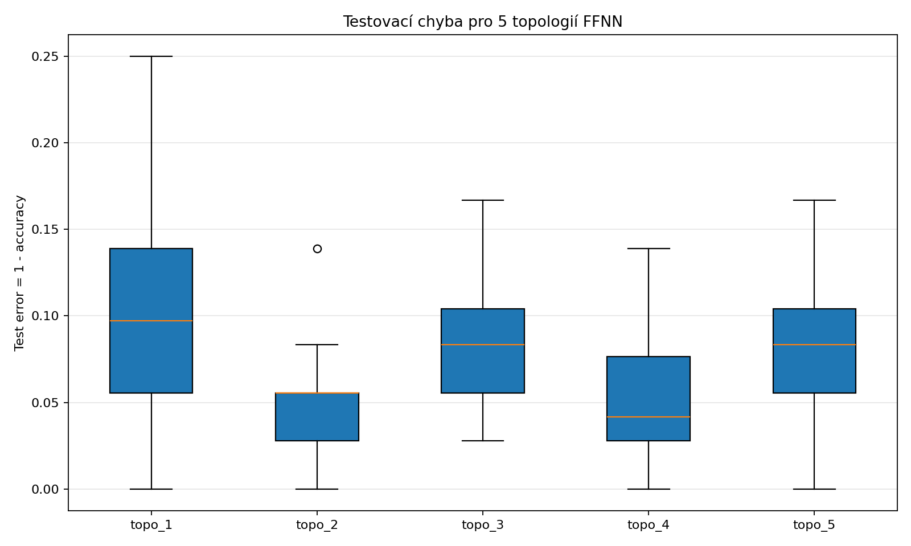
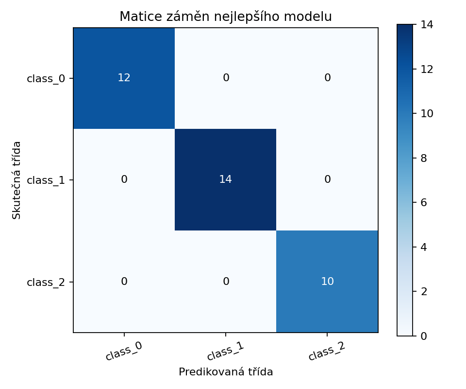
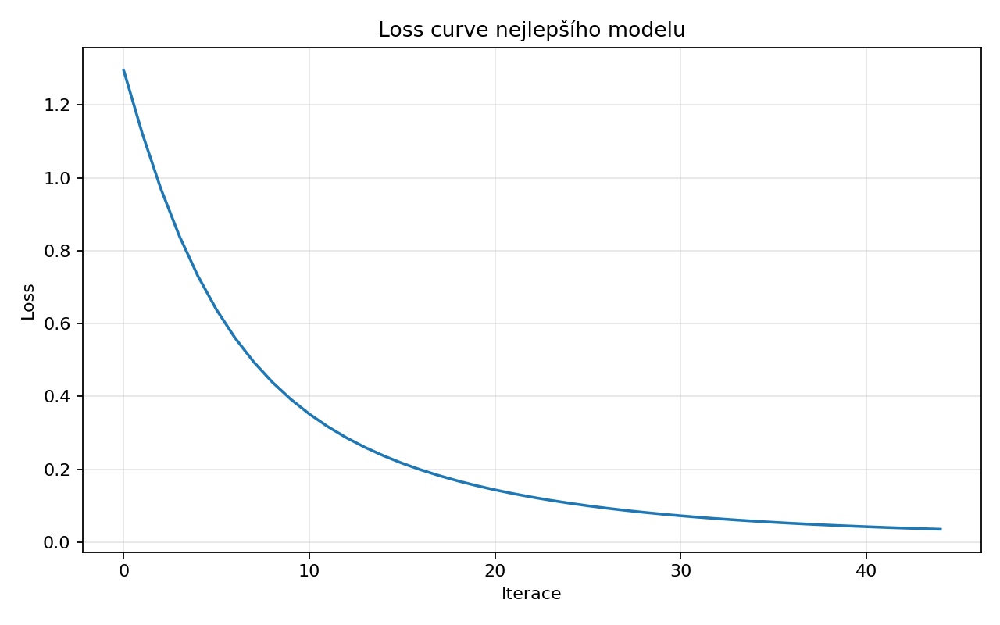

# NNUI2 – Cvičení 6: FFNN klasifikace

## Název experimentu
Porovnání pěti topologií FFNN nad veřejným klasifikačním datasetem Wine.

## Cíl úlohy
Vyhodnotit vliv topologie, aktivační funkce a solveru na klasifikační výkon feedforward neuronové sítě a porovnat variabilitu výsledků mezi 10 běhy každé topologie.

## Popis zadání
Zadání požadovalo alespoň pět různých topologií, deset běhů každé topologie, boxplot testovacích chyb a prezentaci nejlepšího modelu na testovacích datech.

## Použitá data / úprava datasetu
Byl použit veřejný dataset `sklearn.datasets.load_wine` se 13 numerickými příznaky a 3 třídami. Data byla rozdělena na train/validation/test v poměru 60/20/20 a standardizována podle trénovacích dat.

## Postup řešení
- Každá topologie byla natrénována 10x s odlišným `random_state`.
- U každého běhu byla uložena validační přesnost, testovací přesnost a testovací chyba `1 - accuracy`.
- Nejlepší model byl vybrán podle nejnižší testovací chyby; při shodě rozhodla vyšší validační přesnost.

## Implementace / zvolená metoda
Ukázkové materiály pro cvičení 6 jsou orientované na PyTorch, ale v tomto prostředí není knihovna `torch` nainstalována. Aby bylo možné provést poctivě ověřený experiment, byla použita feedforward síť `sklearn.neural_network.MLPClassifier`; tato odchylka je známá a je uvedena i v checklistu.

## Výsledky
- Nejlepší topologie: `topo_2`
- Nejlepší běh: `10` se seedem `1505`
- Val accuracy nejlepšího modelu: `1.0000`
- Test accuracy nejlepšího modelu: `1.0000`
- Test error nejlepšího modelu: `0.0000`

| topologie | hidden layers | aktivace | solver | průměrná test error | nejlepší test accuracy |
| --- | --- | --- | --- | --- | --- |
| topo_1 | (8,) | relu | adam | 0.1028 | 1.0000 |
| topo_2 | (16,) | tanh | adam | 0.0500 | 1.0000 |
| topo_3 | (24,) | relu | sgd | 0.0806 | 0.9722 |
| topo_4 | (24, 12) | tanh | adam | 0.0556 | 1.0000 |
| topo_5 | (32, 16, 8) | relu | adam | 0.0833 | 1.0000 |

## Vizualizace výsledků
### Boxplot testovacích chyb


### Matice záměn nejlepšího modelu


### Loss curve nejlepšího modelu


## Diskuze výsledků
Boxplot i agregované statistiky ukazují, že nejrobustněji vyšly topologie `topo_2` a `topo_4`. `topo_2` má nejnižší průměrnou testovací chybu `0.0500` a současně nízký rozptyl (`stdev 0.0389`), `topo_4` je velmi blízko s průměrem `0.0556`. Naopak `topo_1` a `topo_5` mají vyšší průměrnou chybu i větší rozptyl, takže jejich výsledky jsou citlivější na inicializaci.
Rozptyl mezi deseti běhy je důležitý: například `topo_1` se pohybuje od perfektního výsledku `0.0000` až po test error `0.2500`, což znamená, že samotná existence jednoho dobrého běhu nestačí k označení architektury za robustní. `topo_2` i `topo_4` mají užší rozdělení a působí stabilněji, což je pro praktické použití cennější než ojedinělý nejlepší výsledek.
Confusion matrix nejlepšího modelu je perfektní, všechny tři třídy Wine byly na testu klasifikovány bez chyby (`12/14/10` správně). To je silný výsledek, ale je potřeba ho číst opatrně: testovací množina má jen `36` vzorků a perfektní klasifikace v jednom běhu ještě neznamená, že stejná topologie bude stejně přesná při jiném rozdělení dat.
Z porovnání topologií plyne, že větší síť automaticky nezaručuje lepší výkon. `topo_5` je nejhlubší z testovaných architektur, ale průměrnou testovací chybu má horší než jednodušší `topo_2` a `topo_4`. Pro tento dataset tedy více pomohla rozumně zvolená kapacita a stabilní optimalizace než maximální hloubka modelu.
Největším omezením interpretace je frameworková odchylka: experiment byl ověřen přes `sklearn.neural_network.MLPClassifier`, nikoli přes PyTorch variantu zamýšlenou ve cvičení. Závěry o relativní kvalitě topologií na datasetu Wine jsou stále validní pro použitý fallback, ale nejsou plně přenositelné na implementaci v jiném frameworku s odlišnou inicializací, schedulerem nebo trénovací smyčkou. Dalším krokem by bylo zopakovat stejné topologie přímo v PyTorch po doplnění runtime.

## Závěr
Požadovaný experiment s pěti topologiemi a deseti běhy byl skutečně proveden a výstupy umožňují rozlišit nejen nejlepší jednotlivý model, ale i robustnost architektur napříč inicializacemi. Za nejpřesvědčivější vychází `topo_2`, která kombinuje nejlepší průměrnou chybu s malým rozptylem, zatímco perfektní confusion matrix nejlepšího běhu ukazuje, že dataset Wine je pro zvolenou síť dobře řešitelný.
Současně je ale nutné držet explicitně přiznané omezení: v tomto prostředí nebylo možné ověřit PyTorch implementaci. Repo je proto připravené a poctivě zdokumentované, ale závěry z EXP06 je správné chápat jako závěry z ověřeného `sklearn` fallbacku, nikoli jako přímou validaci PyTorch řešení.

## Příloha – klasifikační report nejlepšího modelu
```text
              precision    recall  f1-score   support

     class_0       1.00      1.00      1.00        12
     class_1       1.00      1.00      1.00        14
     class_2       1.00      1.00      1.00        10

    accuracy                           1.00        36
   macro avg       1.00      1.00      1.00        36
weighted avg       1.00      1.00      1.00        36

```
