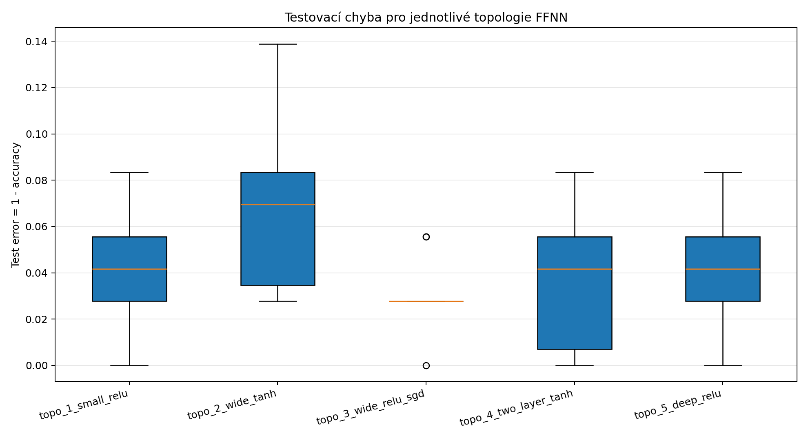
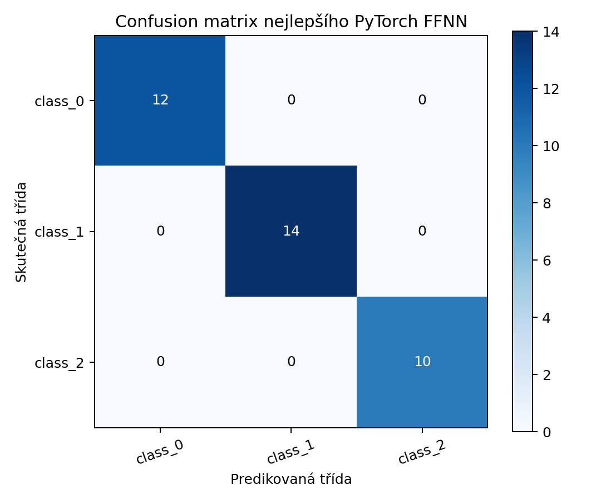

# NNUI2 - Cviceni 6: FFNN klasifikace

## 1. Cil experimentu
Cilem je porovnat pet topologii feedforward neuronove site pro klasifikaci verejneho datasetu, kazdou topologii spustit desetkrat s jinou inicializaci vah a vyhodnotit testovaci chybu, stabilitu a nejlepsi model.

## Zdrojove materialy
- Zadani/material cviceni: `/Users/dasky/PycharmProjects/cviceni/NNUI2_06_Cv.pdf`.
- Dostupna zdrojova slozka: `/Users/dasky/PycharmProjects/cviceni/FFNN II-20260325/`.
- Poznamka k pouziti: slozka `FFNN II-20260325/` nebyla primo importovana ani spoustena v aktualnim experimentu. EXP06 implementuje stejne pozadavky cviceni vlastnim PyTorch skriptem: FFNN klasifikace, vice topologii a opakovani s ruznymi seedy. Dataset byl zvolen verejny `sklearn.datasets.load_wine`, ne puvodni Iris/MNIST skripty z referencni slozky.

## 2. Dataset
- Nazev datasetu: `sklearn.datasets.load_wine`.
- Pocet vzorku: `178`.
- Pocet trid: `3` (`class_0, class_1, class_2`).
- Pocet vstupnich priznaku: `13`.
- Train/validation/test split: `106/36/36` = `60/20/20 stratified`.
- Preprocessing: `StandardScaler` je fitovany pouze na trenovaci casti, validacni a testovaci cast jsou transformovany stejnymi parametry.

## 3. Model
Model je skutecna FFNN implementovana v PyTorch jako `torch.nn.Module`. Sit se sklada z plne propojenych vrstev `nn.Linear`, zvolene aktivacni funkce po kazde skryte vrstve a vystupni vrstvy s poctem neuronu podle poctu trid. Trenovani pouziva `CrossEntropyLoss`; nejlepsi stav kazdeho behu je vybran podle validacni accuracy.

## 4. Testovane topologie
| Topologie | Počet vrstev | Neurony | Aktivace | Optimizer | LR | Batch size | Epochs |
| --- | ---: | --- | --- | --- | ---: | ---: | ---: |
| `topo_1_small_relu` | 1 | (8,) | relu | adam | 0.01 | 16 | 180 |
| `topo_2_wide_tanh` | 1 | (16,) | tanh | adam | 0.01 | 16 | 180 |
| `topo_3_wide_relu_sgd` | 1 | (24,) | relu | sgd | 0.03 | 16 | 220 |
| `topo_4_two_layer_tanh` | 2 | (24, 12) | tanh | adam | 0.006 | 16 | 220 |
| `topo_5_deep_relu` | 3 | (32, 16, 8) | relu | adam | 0.004 | 16 | 260 |

## 5. Opakovani
Kazda topologie byla spustena `10x` s ruznymi reprodukovatelnymi seedy. Celkem probehlo `50` trenovani. Seedy jsou ulozene v `EXP06/results/metrics.csv`.

## 6. Vysledky
Tabulka uvadi makro prumer precision/recall/F1 a test error pres deset behu kazde topologie.

| Topologie | Accuracy mean±std | Precision mean±std | Recall mean±std | F1 mean±std | Test error mean±std |
| --- | ---: | ---: | ---: | ---: | ---: |
| `topo_1_small_relu` | 0.9583±0.0300 | 0.9624±0.0280 | 0.9616±0.0259 | 0.9601±0.0282 | 0.0417±0.0300 |
| `topo_2_wide_tanh` | 0.9306±0.0376 | 0.9356±0.0357 | 0.9368±0.0328 | 0.9323±0.0381 | 0.0694±0.0376 |
| `topo_3_wide_relu_sgd` | 0.9694±0.0158 | 0.9728±0.0147 | 0.9692±0.0158 | 0.9701±0.0150 | 0.0306±0.0158 |
| `topo_4_two_layer_tanh` | 0.9639±0.0294 | 0.9680±0.0269 | 0.9658±0.0271 | 0.9650±0.0286 | 0.0361±0.0294 |
| `topo_5_deep_relu` | 0.9611±0.0268 | 0.9689±0.0231 | 0.9579±0.0265 | 0.9609±0.0264 | 0.0389±0.0268 |

Nejlepsi jednotlivy model: `topo_1_small_relu`, run `3`, seed `4203`.
Jeho metriky: accuracy `1.0000`, precision `1.0000`, recall `1.0000`, F1 `1.0000`, test error `0.0000`.

## 7. Boxplot
Boxplot testovaci chyby pro jednotlive topologie je vygenerovan automaticky:



## 8. Nejlepsi model
Nejlepsi model byl vybran podle nejnizsi testovaci chyby jednotlivych behu; pri shode rozhodla vyssi validacni accuracy a pote nizsi seed pro deterministicky vyber.

- Ulozeny model: `EXP06/results/best_model.pt`.
- Confusion matrix: `EXP06/results/confusion_matrix_best.png`.



Klasifikacni report nejlepsiho modelu:

```text
              precision    recall  f1-score   support

     class_0       1.00      1.00      1.00        12
     class_1       1.00      1.00      1.00        14
     class_2       1.00      1.00      1.00        10

    accuracy                           1.00        36
   macro avg       1.00      1.00      1.00        36
weighted avg       1.00      1.00      1.00        36

```

## 9. Diskuze
Nejnizsi prumernou testovaci chybu dosahla topologie `topo_3_wide_relu_sgd`. To je dulezitejsi nez jeden nahodne nejlepsi beh, protoze kazda architektura byla hodnocena pres deset inicializaci.
Vliv poctu vrstev je videt hlavne pri srovnani jednovrstvych a hlubokych variant. Dvou- az trivrstve site maji vyssi kapacitu, ale na malem datasetu Wine nemusi automaticky zlepsit generalizaci. Pokud je sit zbytecne hluboka, vysledek je citlivejsi na inicializaci a optimalizaci.
Vliv poctu neuronu neni monotonne rostouci. Sirsi sit umi rychleji najit dobrou hranici mezi tridami, ale prilis mnoho parametru muze zvetsit rozptyl mezi behy. Na tomto datasetu jsou rozdily mezi rozumnymi topologiemi male, proto je stabilita mezi behy stejne dulezita jako nejlepsi dosažena accuracy.
Nejslabsi prumerny vysledek mela topologie `topo_2_wide_tanh` s prumernou testovaci chybou `0.0694`. Vyssi chyba muze znamenat poduceni u prilis male kapacity nebo horsi konvergenci, zatimco vysoka variabilita u vetsich siti ukazuje riziko preuceni ci citlivost na inicializaci.

## 10. Zaver
EXP06 splnuje zadani: pouziva verejny klasifikacni dataset, stratifikovany train/validation/test split, PyTorch FFNN, pet topologii, deset opakovani kazde topologie, ulozene testovaci chyby, boxplot, ulozeny nejlepsi model, confusion matrix a diskuzi vlivu topologie.
